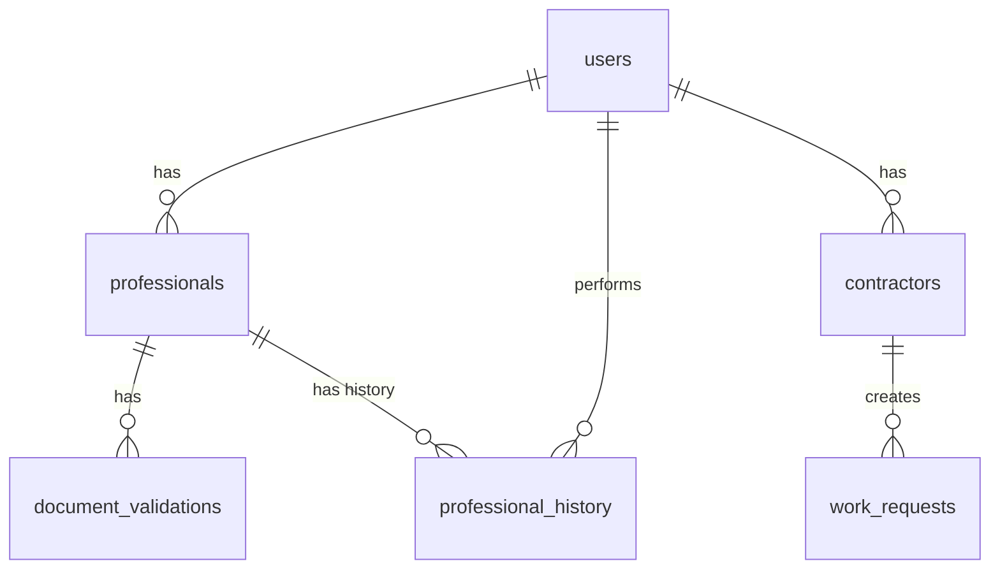

# 🗄️ Schema Oficial do Banco de Dados - HRX Platform

> **Versão:** 1.0.0
> **Última Atualização:** 2025-10-21
> **ATENÇÃO:** Este é o schema canônico. Todas as migrations devem seguir esta estrutura.

---

## 📋 Índice

1. [Tabela: users](#tabela-users)
2. [Tabela: professionals](#tabela-professionals)
3. [Tabela: document_validations](#tabela-document_validations)
4. [Tabela: professional_history](#tabela-professional_history)
5. [Tabela: contractors](#tabela-contractors)
6. [Tabela: work_requests](#tabela-work_requests)
7. [Relationships](#relationships)

---

## Tabela: `users`

Usuários do sistema (autenticação via Clerk)

```sql
CREATE TABLE users (
  -- IDs
  id UUID PRIMARY KEY DEFAULT gen_random_uuid(),
  clerk_id VARCHAR(255) UNIQUE NOT NULL,

  -- Dados Básicos
  email VARCHAR(255) UNIQUE NOT NULL,
  full_name VARCHAR(255),

  -- Tipo de Usuário
  user_type VARCHAR(20) NOT NULL CHECK (user_type IN ('professional', 'contractor', 'admin')),

  -- Timestamps
  created_at TIMESTAMP WITH TIME ZONE DEFAULT NOW(),
  updated_at TIMESTAMP WITH TIME ZONE DEFAULT NOW()
);

-- Índices
CREATE INDEX idx_users_clerk_id ON users(clerk_id);
CREATE INDEX idx_users_email ON users(email);
CREATE INDEX idx_users_user_type ON users(user_type);
```

**Campos:**

| Campo | Tipo | Nullable | Default | Descrição |
|-------|------|----------|---------|-----------|
| `id` | UUID | NO | gen_random_uuid() | ID interno do usuário |
| `clerk_id` | VARCHAR(255) | NO | - | ID do Clerk (autenticação) |
| `email` | VARCHAR(255) | NO | - | Email do usuário |
| `full_name` | VARCHAR(255) | YES | NULL | Nome completo |
| `user_type` | VARCHAR(20) | NO | - | Tipo: professional, contractor, admin |
| `created_at` | TIMESTAMP | NO | NOW() | Data de criação |
| `updated_at` | TIMESTAMP | NO | NOW() | Data de última atualização |

---

## Tabela: `professionals`

Profissionais cadastrados na plataforma

```sql
CREATE TABLE professionals (
  -- IDs e Relacionamentos
  id UUID PRIMARY KEY DEFAULT gen_random_uuid(),
  user_id UUID REFERENCES users(id) ON DELETE CASCADE,
  clerk_id VARCHAR(255) UNIQUE,

  -- Dados Pessoais
  full_name VARCHAR(255) NOT NULL,
  cpf VARCHAR(14) UNIQUE NOT NULL,
  birth_date DATE NOT NULL,
  email VARCHAR(255) NOT NULL,
  phone VARCHAR(20) NOT NULL,

  -- Endereço
  cep VARCHAR(9),
  street VARCHAR(255),
  number VARCHAR(10),
  complement VARCHAR(100),
  neighborhood VARCHAR(100),
  city VARCHAR(100),
  state VARCHAR(2),

  -- Experiência
  categories JSONB NOT NULL DEFAULT '[]',
  has_experience BOOLEAN DEFAULT false,
  experience_description TEXT,
  years_of_experience VARCHAR(10),

  -- Disponibilidade (JSONB)
  availability JSONB NOT NULL DEFAULT '{"weekdays":false,"weekends":false,"holidays":false,"night":false,"travel":false}',

  -- Documentos (JSONB com URLs)
  documents JSONB DEFAULT '{}',
  portfolio JSONB DEFAULT '[]',

  -- Campos Específicos de Documentos
  cnh_number VARCHAR(20),
  cnh_validity DATE,
  cnv_validity DATE,
  nr10_validity DATE,
  nr35_validity DATE,
  drt_validity DATE,

  -- Dados Bancários
  bank_name VARCHAR(100),
  account_type VARCHAR(20),
  agency VARCHAR(10),
  account_number VARCHAR(20),
  pix_key VARCHAR(100),

  -- Controle
  status VARCHAR(20) DEFAULT 'pending' CHECK (status IN ('pending', 'approved', 'rejected')),
  accepts_notifications BOOLEAN DEFAULT true,

  -- Timestamps e Aprovação
  created_at TIMESTAMP WITH TIME ZONE DEFAULT NOW(),
  updated_at TIMESTAMP WITH TIME ZONE DEFAULT NOW(),
  approved_at TIMESTAMP WITH TIME ZONE,
  approved_by UUID REFERENCES users(id)
);

-- Índices
CREATE INDEX idx_professionals_user_id ON professionals(user_id);
CREATE INDEX idx_professionals_clerk_id ON professionals(clerk_id);
CREATE INDEX idx_professionals_cpf ON professionals(cpf);
CREATE INDEX idx_professionals_status ON professionals(status);
CREATE INDEX idx_professionals_city ON professionals(city);
CREATE INDEX idx_professionals_state ON professionals(state);
CREATE INDEX idx_professionals_categories ON professionals USING GIN (categories);

-- Trigger para updated_at
CREATE TRIGGER update_professionals_updated_at
  BEFORE UPDATE ON professionals
  FOR EACH ROW
  EXECUTE FUNCTION update_updated_at_column();
```

**Campos:**

| Campo | Tipo | Nullable | Descrição | Mapeamento Código |
|-------|------|----------|-----------|-------------------|
| `id` | UUID | NO | ID do profissional | `id` |
| `user_id` | UUID | YES | FK para users | `userId` |
| `clerk_id` | VARCHAR(255) | YES | ID do Clerk (duplicado para performance) | `clerkId` |
| `full_name` | VARCHAR(255) | NO | Nome completo | `fullName` |
| `cpf` | VARCHAR(14) | NO | CPF (único) | `cpf` |
| `birth_date` | DATE | NO | Data de nascimento | `birthDate` |
| `email` | VARCHAR(255) | NO | Email | `email` |
| `phone` | VARCHAR(20) | NO | Telefone | `phone` |
| `cep` | VARCHAR(9) | YES | CEP | `cep` |
| `street` | VARCHAR(255) | YES | Logradouro | `street` |
| `number` | VARCHAR(10) | YES | Número | `number` |
| `complement` | VARCHAR(100) | YES | Complemento | `complement` |
| `neighborhood` | VARCHAR(100) | YES | Bairro | `neighborhood` |
| `city` | VARCHAR(100) | YES | Cidade | `city` |
| `state` | VARCHAR(2) | YES | UF | `state` |
| `categories` | JSONB | NO | Array de categorias | `categories` |
| `has_experience` | BOOLEAN | YES | Tem experiência? | `hasExperience` |
| `experience_description` | TEXT | YES | Descrição da experiência | `experienceDescription` |
| `years_of_experience` | VARCHAR(10) | YES | Anos de experiência | `yearsOfExperience` |
| `availability` | JSONB | NO | Disponibilidade (objeto) | `availability` |
| `documents` | JSONB | YES | Documentos (objeto com URLs) | `documents` |
| `portfolio` | JSONB | YES | Portfolio (array de URLs) | `portfolio` |
| `cnh_number` | VARCHAR(20) | YES | Número da CNH | `cnhNumber` ⚠️ |
| `cnh_validity` | DATE | YES | Validade da CNH | `cnhValidity` ⚠️ |
| `cnv_validity` | DATE | YES | Validade do CNV | `cnvValidity` ⚠️ |
| `nr10_validity` | DATE | YES | Validade do NR10 | `nr10Validity` ⚠️ |
| `nr35_validity` | DATE | YES | Validade do NR35 | `nr35Validity` ⚠️ |
| `drt_validity` | DATE | YES | Validade do DRT | `drtValidity` ⚠️ |
| `bank_name` | VARCHAR(100) | YES | Nome do banco | `bankName` |
| `account_type` | VARCHAR(20) | YES | Tipo de conta | `accountType` |
| `agency` | VARCHAR(10) | YES | Agência | `agency` |
| `account_number` | VARCHAR(20) | YES | Número da conta | `accountNumber` |
| `pix_key` | VARCHAR(100) | YES | Chave PIX | `pixKey` |
| `status` | VARCHAR(20) | NO | Status do cadastro | `status` |
| `accepts_notifications` | BOOLEAN | YES | Aceita notificações? | `acceptsNotifications` |
| `created_at` | TIMESTAMP | NO | Data de criação | `createdAt` |
| `updated_at` | TIMESTAMP | NO | Última atualização | `updatedAt` |
| `approved_at` | TIMESTAMP | YES | Data de aprovação | `approvedAt` |
| `approved_by` | UUID | YES | Aprovado por (user_id) | `approvedBy` |

⚠️ **ATENÇÃO:** Campos marcados com ⚠️ estão com nomenclatura inconsistente (ver IMPROVEMENT_ROADMAP.md #2)

**Estrutura do JSONB `documents`:**
```json
{
  "rg_front": "https://...",
  "rg_back": "https://...",
  "cpf": "https://...",
  "proof_of_address": "https://...",
  "cnh_photo": "https://...",
  "nr10": "https://...",
  "nr35": "https://...",
  "drt": "https://...",
  "cnv": "https://..."
}
```

**Estrutura do JSONB `availability`:**
```json
{
  "weekdays": true,
  "weekends": false,
  "holidays": true,
  "night": false,
  "travel": true
}
```

**Estrutura do JSONB `categories`:**
```json
["Motorista", "Segurança", "Garçom"]
```

---

## Tabela: `document_validations`

Histórico de validações de documentos dos profissionais

```sql
CREATE TABLE document_validations (
  -- IDs
  id UUID PRIMARY KEY DEFAULT gen_random_uuid(),
  professional_id UUID REFERENCES professionals(id) ON DELETE CASCADE NOT NULL,

  -- Documento
  document_type VARCHAR(50) NOT NULL,
  document_url TEXT NOT NULL,
  version INTEGER DEFAULT 1,

  -- Validação
  status VARCHAR(20) NOT NULL DEFAULT 'pending' CHECK (status IN ('pending', 'approved', 'rejected')),
  rejection_reason TEXT,

  -- Revisão
  reviewed_by UUID REFERENCES users(id),
  reviewed_at TIMESTAMP WITH TIME ZONE,

  -- Timestamps
  created_at TIMESTAMP WITH TIME ZONE DEFAULT NOW(),
  updated_at TIMESTAMP WITH TIME ZONE DEFAULT NOW()
);

-- Índices
CREATE INDEX idx_doc_validations_professional_id ON document_validations(professional_id);
CREATE INDEX idx_doc_validations_status ON document_validations(status);
CREATE INDEX idx_doc_validations_document_type ON document_validations(document_type);

-- Constraint: Apenas uma validação por tipo + versão
CREATE UNIQUE INDEX idx_doc_validations_unique_version
  ON document_validations(professional_id, document_type, version);
```

**Campos:**

| Campo | Tipo | Descrição |
|-------|------|-----------|
| `id` | UUID | ID da validação |
| `professional_id` | UUID | FK para professionals |
| `document_type` | VARCHAR(50) | Tipo do documento (rg_front, cpf, etc) |
| `document_url` | TEXT | URL do documento no storage |
| `version` | INTEGER | Versão do documento (para reenvios) |
| `status` | VARCHAR(20) | pending, approved, rejected |
| `rejection_reason` | TEXT | Motivo da rejeição |
| `reviewed_by` | UUID | Quem revisou (admin) |
| `reviewed_at` | TIMESTAMP | Quando foi revisado |
| `created_at` | TIMESTAMP | Data de criação |
| `updated_at` | TIMESTAMP | Última atualização |

---

## Tabela: `professional_history`

Histórico de ações sobre profissionais (auditoria)

```sql
CREATE TABLE professional_history (
  -- IDs
  id UUID PRIMARY KEY DEFAULT gen_random_uuid(),
  professional_id UUID REFERENCES professionals(id) ON DELETE CASCADE NOT NULL,
  action_by UUID REFERENCES users(id) NOT NULL,

  -- Ação
  action_type VARCHAR(50) NOT NULL,
  field_changed VARCHAR(100),
  old_value TEXT,
  new_value TEXT,
  description TEXT,

  -- Timestamp
  created_at TIMESTAMP WITH TIME ZONE DEFAULT NOW()
);

-- Índices
CREATE INDEX idx_prof_history_professional_id ON professional_history(professional_id);
CREATE INDEX idx_prof_history_action_by ON professional_history(action_by);
CREATE INDEX idx_prof_history_action_type ON professional_history(action_type);
CREATE INDEX idx_prof_history_created_at ON professional_history(created_at DESC);
```

---

## Tabela: `contractors`

Contratantes de profissionais

```sql
CREATE TABLE contractors (
  -- IDs
  id UUID PRIMARY KEY DEFAULT gen_random_uuid(),
  user_id UUID REFERENCES users(id) ON DELETE CASCADE,
  clerk_id VARCHAR(255) UNIQUE,

  -- Dados da Empresa
  company_name VARCHAR(255) NOT NULL,
  trade_name VARCHAR(255),
  cnpj VARCHAR(18) UNIQUE NOT NULL,

  -- Contato
  email VARCHAR(255) NOT NULL,
  phone VARCHAR(20) NOT NULL,

  -- Endereço
  cep VARCHAR(9),
  street VARCHAR(255),
  number VARCHAR(10),
  complement VARCHAR(100),
  neighborhood VARCHAR(100),
  city VARCHAR(100),
  state VARCHAR(2),

  -- Responsável
  responsible_name VARCHAR(255) NOT NULL,
  responsible_cpf VARCHAR(14) NOT NULL,
  responsible_phone VARCHAR(20) NOT NULL,

  -- Controle
  status VARCHAR(20) DEFAULT 'pending' CHECK (status IN ('pending', 'approved', 'rejected', 'blocked')),

  -- Timestamps
  created_at TIMESTAMP WITH TIME ZONE DEFAULT NOW(),
  updated_at TIMESTAMP WITH TIME ZONE DEFAULT NOW(),
  approved_at TIMESTAMP WITH TIME ZONE,
  approved_by UUID REFERENCES users(id)
);

-- Índices
CREATE INDEX idx_contractors_user_id ON contractors(user_id);
CREATE INDEX idx_contractors_clerk_id ON contractors(clerk_id);
CREATE INDEX idx_contractors_cnpj ON contractors(cnpj);
CREATE INDEX idx_contractors_status ON contractors(status);
```

---

## Tabela: `work_requests`

Solicitações de trabalho dos contratantes

```sql
CREATE TABLE work_requests (
  -- IDs
  id UUID PRIMARY KEY DEFAULT gen_random_uuid(),
  contractor_id UUID REFERENCES contractors(id) ON DELETE CASCADE NOT NULL,

  -- Evento
  event_name VARCHAR(255) NOT NULL,
  event_type VARCHAR(100) NOT NULL,
  event_date DATE NOT NULL,
  event_start_time TIME,
  event_end_time TIME,

  -- Local
  event_address VARCHAR(500) NOT NULL,
  event_city VARCHAR(100) NOT NULL,
  event_state VARCHAR(2) NOT NULL,

  -- Profissionais Necessários (JSONB)
  needed_professionals JSONB NOT NULL DEFAULT '{}',
  total_professionals INTEGER NOT NULL,

  -- Observações
  additional_info TEXT,

  -- Controle
  status VARCHAR(20) DEFAULT 'pending' CHECK (status IN ('pending', 'in_progress', 'completed', 'cancelled')),

  -- Timestamps
  created_at TIMESTAMP WITH TIME ZONE DEFAULT NOW(),
  updated_at TIMESTAMP WITH TIME ZONE DEFAULT NOW()
);

-- Índices
CREATE INDEX idx_work_requests_contractor_id ON work_requests(contractor_id);
CREATE INDEX idx_work_requests_status ON work_requests(status);
CREATE INDEX idx_work_requests_event_date ON work_requests(event_date);
CREATE INDEX idx_work_requests_event_city ON work_requests(event_city);
```

**Estrutura do JSONB `needed_professionals`:**
```json
{
  "Motorista": 2,
  "Segurança": 5,
  "Garçom": 10
}
```

---

## Relationships



---

## Tipos Enumerados (ENUMs como CHECK constraints)

### user_type
- `professional`
- `contractor`
- `admin`

### professional_status
- `pending` - Aguardando análise
- `approved` - Aprovado para trabalhar
- `rejected` - Cadastro rejeitado

### document_validation_status
- `pending` - Aguardando análise
- `approved` - Documento válido
- `rejected` - Documento rejeitado

### contractor_status
- `pending` - Aguardando análise
- `approved` - Aprovado
- `rejected` - Rejeitado
- `blocked` - Bloqueado

### work_request_status
- `pending` - Aguardando processamento
- `in_progress` - Em andamento
- `completed` - Concluído
- `cancelled` - Cancelado

---

## Triggers

### update_updated_at_column

Atualiza automaticamente o campo `updated_at` em todas as tabelas

```sql
CREATE OR REPLACE FUNCTION update_updated_at_column()
RETURNS TRIGGER AS $$
BEGIN
  NEW.updated_at = NOW();
  RETURN NEW;
END;
$$ LANGUAGE plpgsql;

-- Aplicar em todas as tabelas com updated_at
CREATE TRIGGER update_users_updated_at
  BEFORE UPDATE ON users
  FOR EACH ROW EXECUTE FUNCTION update_updated_at_column();

CREATE TRIGGER update_professionals_updated_at
  BEFORE UPDATE ON professionals
  FOR EACH ROW EXECUTE FUNCTION update_updated_at_column();

CREATE TRIGGER update_contractors_updated_at
  BEFORE UPDATE ON contractors
  FOR EACH ROW EXECUTE FUNCTION update_updated_at_column();

CREATE TRIGGER update_work_requests_updated_at
  BEFORE UPDATE ON work_requests
  FOR EACH ROW EXECUTE FUNCTION update_updated_at_column();

CREATE TRIGGER update_document_validations_updated_at
  BEFORE UPDATE ON document_validations
  FOR EACH ROW EXECUTE FUNCTION update_updated_at_column();
```

---

## Row Level Security (RLS)

⚠️ **ATENÇÃO:** RLS está **DESABILITADO** para facilitar operações administrativas.

Se precisar habilitar no futuro:

```sql
-- Habilitar RLS
ALTER TABLE professionals ENABLE ROW LEVEL SECURITY;

-- Políticas exemplo
CREATE POLICY "Profissionais podem ver próprio perfil"
  ON professionals FOR SELECT
  USING (clerk_id = auth.uid());

CREATE POLICY "Admins podem ver todos"
  ON professionals FOR ALL
  USING (auth.jwt() ->> 'user_type' = 'admin');
```

---

## Convenções

1. **Sempre usar `snake_case` no banco**
2. **UUIDs para todas as primary keys**
3. **TIMESTAMP WITH TIME ZONE para datas**
4. **VARCHAR com limite adequado**
5. **JSONB para estruturas flexíveis** (não JSON)
6. **CHECK constraints para enums**
7. **Índices em FKs e campos filtrados**
8. **ON DELETE CASCADE em relacionamentos obrigatórios**

---

## Backups e Migrations

**Frequência de Backup:** Diário (automático via Supabase)

**Ordem de Execução das Migrations:**
1. `001_users_table.sql`
2. `002_professionals_table.sql`
3. `003_add_portfolio_column.sql`
4. `003_add_triggers_and_clerk_id.sql`
5. `004_contractors_and_requests_tables.sql`
6. `005_create_equipment_suppliers.sql`
7. `create_admin_tables.sql`

---

**Última revisão:** 2025-10-21
**Próxima revisão:** Mensal ou quando houver mudanças estruturais
